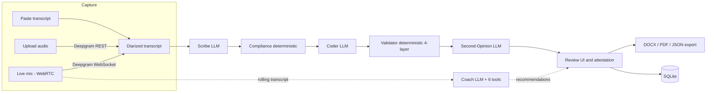

# DentaScribe

DentaScribe is a multi-agent AI scribe for dental encounters: it turns a dentist–patient conversation into a structured, transcript-grounded SOAP note with CDT billing codes, a regulatory compliance checklist, and a provider sign-off workflow.

It is built for licensed dentists practicing under Texas record-keeping rules (TSBDE, 22 TAC §108.8), with the compliance layer implemented as deterministic code rather than model output. Every clinical claim the model emits must quote the transcript verbatim, and every billing code must come from a sealed allow-list — anti-hallucination is enforced by a validator, not requested in a prompt. The app runs end-to-end in a keyless demo mode for evaluation, and in live mode against real speech-to-text and LLM APIs. It is not a diagnostic device: a provider reviews and signs every note.

## Architecture at a glance

- **Orchestration pattern:** a sequential agent pipeline with streamed progress. A single orchestrator (`agents/swarm.py`) runs Scribe → Compliance → Coder → Validator → Second-Opinion in order, yielding each stage's result as it completes so the UI can render live status. Separately, a live **Coach** agent (`agents/coach_agent.py`) runs during recording as a bounded single-agent tool-use loop (≤5 turns per invocation) over six deterministic, pure-Python tools.
- **Models:** Anthropic Claude (`claude-sonnet-4-5` by default) for the two generative agents (Scribe, Coder), the Second-Opinion reviewer, and the Coach — all through one chokepoint client (`core/llm_client.py`). Deepgram `nova-3-medical` for speech-to-text (REST for uploaded files, WebSocket for the live microphone). Compliance and Validator stages are deterministic Python — no LLM.
- **Frameworks:** Streamlit (UI), `jsonschema` (output contract), `python-docx` / `reportlab` (exports), `streamlit-webrtc` + PyAV (live audio).
- **Memory / session state:** Streamlit `st.session_state` per browser session; SQLite for persistence (`storage/db.py`: encounters, transcripts, versioned SOAP notes, per-call LLM audit log, attestations, exports). There is no cross-run conversational memory — each swarm run is stateless given its transcript.
- **Retrieval:** none at runtime (no vector store). Controlled dental vocabulary, the CDT code allow-list, visit-type templates, and the blank SOAP template are versioned JSON assets in `data/` injected directly into prompts.



## Quickstart

Requires Python 3.11+ and [uv](https://docs.astral.sh/uv/).

```bash
git clone <this-repository> dentascribe
cd dentascribe
uv sync                       # installs runtime deps from pyproject.toml
cp .env.example .env          # optional — demo mode needs no keys
uv run streamlit run app.py
```

Expected output:

```
  You can now view your Streamlit app in your browser.

  Local URL: http://localhost:8501
```

Open the URL, keep the sidebar mode on **Demo**, load a sample transcript on the Record page, and run the swarm — the full pipeline (SOAP draft, compliance checklist, CDT codes, validation score, second opinion, export) works with zero API keys using deterministic fixtures.

Run the test suite (also keyless):

```bash
uv run pytest
# 102 passed
```

Notes:

- **Live mode** requires `ANTHROPIC_API_KEY` (agents) and `DEEPGRAM_API_KEY` (speech-to-text). The sidebar falls back to Demo automatically when no key is set.
- **Live microphone** additionally needs `streamlit-webrtc` and `av`, which are imported lazily and are not in the base manifests: `uv pip install streamlit-webrtc av`. The page shows an install hint if they are missing.
- On Streamlit Community Cloud, secrets set in the app settings are bridged into environment variables at startup (`app.py`), so the same configuration names work there.
- `requirements.txt` is an alternative pip manifest that additionally covers the audio-preprocessing extras (`scipy`, `noisereduce`, `numpy`) used by the file-upload STT path.

## Configuration

| Variable | What it is | Where to get / notes |
|---|---|---|
| `ANTHROPIC_API_KEY` | Enables live LLM calls (Scribe, Coder, Second-Opinion, Coach) | Anthropic Console. Absent → demo mode |
| `DENTASCRIBE_MODEL` | Model id used by the canonical LLM client | Default `claude-sonnet-4-5` |
| `DEEPGRAM_API_KEY` | Speech-to-text for uploaded audio and live mic | Deepgram Console. Absent → paste/demo input only |
| `DEEPGRAM_MODEL` | Deepgram model for the live WebSocket path | Default `nova-3-medical` |
| `OPENAI_API_KEY` | Optional: TTS fallback for synthesizing demo dialogue audio; also the fallback provider in the legacy client (`utils/llm.py`) | OpenAI dashboard |
| `ELEVENLABS_API_KEY` | Optional: preferred TTS for two-voice demo dialogue synthesis | ElevenLabs dashboard |
| `ELEVENLABS_VOICE_DOCTOR` / `ELEVENLABS_VOICE_PATIENT` | Voice-id overrides for the synthesized doctor/patient | Defaults are public ElevenLabs library voices |
| `DENTASCRIBE_DEMO_MODE` | `auto` \| `true` \| `false` — forces or disables demo mode in the legacy config path (`core/config.py`) | Default `auto` (demo when no LLM key) |
| `DENTASCRIBE_DB_PATH` | SQLite database path | Default `./dentascribe.db` |
| `ANTHROPIC_MODEL`, `OPENAI_MODEL`, `STT_PROVIDER`, `WHISPER_MODEL` | Read only by the legacy config/client path (`core/config.py`, `utils/llm.py`), not by the main pipeline | Leave unset unless using that path |
| `CLINIC_NAME`, `CLINIC_ADDRESS`, `PROVIDER_NAME`, `PROVIDER_TSBDE_LICENSE`, `DENTASCRIBE_LOG_LEVEL` | Declared in `.env.example` for clinic identity, but **not currently read by the code** — encounter metadata is set in `ui/pages/record_page.py` | Placeholder for a future auth/identity layer |

## Documentation

- [docs/ARCHITECTURE.md](docs/ARCHITECTURE.md) — component map, data flow, orchestration analysis, state and context engineering, design decisions.
- [docs/EVALUATION.md](docs/EVALUATION.md) — what is actually tested (102 automated tests), edge cases handled in code, and a proposed evaluation harness.
- [docs/HARDENING.md](docs/HARDENING.md) — current security posture, health-data honesty, and a staged path to production.

## License and disclaimers

For pilot and evaluation use only. Not FDA-cleared and not a substitute for clinical judgment; a licensed provider must review and sign every note, and the export embeds an AI-assisted disclosure in the attestation block. The bundled CDT code subset is for development — CDT codes are © American Dental Association and production use requires an ADA license.
